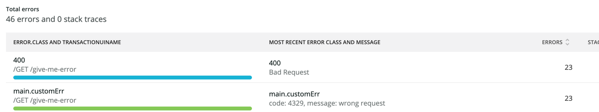
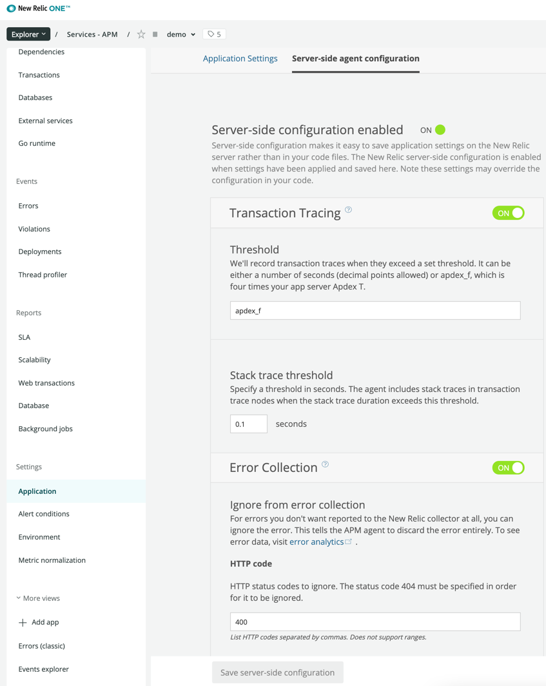
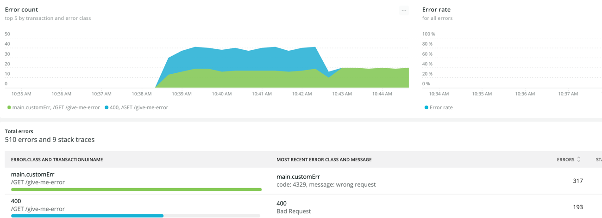

# Noticing Custom Errors

This guide explains how to handle custom errors with nrfiber's error reporting feature for both Fiber v2 and v3.

## Overview

When you enable nrfiber's `NoticeError` feature and return specific status codes (like 400), you may notice duplicate error reporting in New Relic. This happens because the New Relic agent automatically reports certain HTTP status codes as errors, in addition to your custom error types.

This guide shows you how to:
1. Report custom errors to New Relic
2. Avoid duplicate error reporting
3. Configure New Relic to ignore automatic status code errors

## Example Scenario

Let's assume you're returning a `400` status code on a `GET /give-me-error` endpoint with custom error details.

### Fiber v3 Example

```go
package main

import (
	"fmt"
	"log"
	"net/http"

	"github.com/cguajardo-imed/nrfiber/v3"
	"github.com/gofiber/fiber/v3"
	"github.com/newrelic/go-agent/v3/newrelic"
)

type customErr struct {
	Message string `json:"message"`
	Code    int    `json:"code"`
}

func (ce customErr) Error() string {
	return fmt.Sprintf("code: %d, message: %s", ce.Code, ce.Message)
}

func main() {
	app := fiber.New()
	
	nr, err := newrelic.NewApplication(
		newrelic.ConfigEnabled(true),
		newrelic.ConfigAppName("demo"),
		newrelic.ConfigLicense("license-key"),
	)
	if err != nil {
		log.Fatal(err)
	}
	
	// Enable error notice reporting, but ignore 401 status codes
	app.Use(nrfiber.Middleware(nr, 
		nrfiber.ConfigNoticeErrorEnabled(true),
		nrfiber.ConfigStatusCodeIgnored([]int{401}),
	))
	
	app.Get("/give-me-error", func(c fiber.Ctx) error {
		err := customErr{Message: "wrong request", Code: 4329}
		c.Status(http.StatusBadRequest).JSON(err)
		return err
	})
	
	app.Listen(":3000")
}
```

### Fiber v2 Example

```go
package main

import (
	"fmt"
	"log"
	"net/http"

	"github.com/cguajardo-imed/nrfiber/v2"
	"github.com/gofiber/fiber/v2"
	"github.com/newrelic/go-agent/v3/newrelic"
)

type customErr struct {
	Message string `json:"message"`
	Code    int    `json:"code"`
}

func (ce customErr) Error() string {
	return fmt.Sprintf("code: %d, message: %s", ce.Code, ce.Message)
}

func main() {
	app := fiber.New()
	
	nr, err := newrelic.NewApplication(
		newrelic.ConfigEnabled(true),
		newrelic.ConfigAppName("demo"),
		newrelic.ConfigLicense("license-key"),
	)
	if err != nil {
		log.Fatal(err)
	}
	
	// Enable error notice reporting, but ignore 401 status codes
	app.Use(nrfiber.Middleware(nr, 
		nrfiber.ConfigNoticeErrorEnabled(true),
		nrfiber.ConfigStatusCodeIgnored([]int{401}),
	))
	
	app.Get("/give-me-error", func(c *fiber.Ctx) error {
		err := customErr{Message: "wrong request", Code: 4329}
		c.Status(http.StatusBadRequest).JSON(err)
		return err
	})
	
	app.Listen(":3000")
}
```

**Note:** The only difference between v2 and v3 is the context parameter type (`*fiber.Ctx` for v2, `fiber.Ctx` for v3).

## Testing the Endpoint

When you call the endpoint, you'll see your custom error response:

```shell
$ curl -i localhost:3000/give-me-error
HTTP/1.1 400 Bad Request
Date: Sun, 22 Aug 2021 10:30:14 GMT
Content-Type: application/json
Content-Length: 39

{"message":"wrong request","code":4329}
```

## The Duplicate Error Problem

Without proper configuration, you may see duplicate errors in New Relic like this:



This happens because:
1. Your application returns a custom error (which nrfiber reports)
2. The New Relic agent automatically reports HTTP 400 status codes as errors

## Solution: Configure New Relic to Ignore Status Codes

You can resolve this by telling New Relic to ignore certain HTTP status codes on the server side, allowing only your custom error types to be reported.

### Steps:

1. Go to your New Relic application settings
2. Navigate to **Application Settings → Server-side agent configuration → Error Collection**
3. Add the HTTP status codes you want to ignore (e.g., `400-499` for all client errors)



### Result

After configuring New Relic to ignore HTTP status codes, you'll only see your custom errors:



## Best Practices

1. **Use Custom Error Types**: Define meaningful error types with context (not just HTTP status codes)
   ```go
   type ValidationError struct {
       Field   string `json:"field"`
       Message string `json:"message"`
       Code    int    `json:"code"`
   }
   ```

2. **Ignore Expected Client Errors**: Use `ConfigStatusCodeIgnored()` for errors that don't need tracking:
   ```go
   nrfiber.ConfigStatusCodeIgnored([]int{400, 401, 403, 404})
   ```

3. **Configure Server-Side Filtering**: Set up New Relic's error collection settings to avoid duplicate reporting

4. **Use Meaningful Error Messages**: Include context that helps debug the issue:
   ```go
   return customErr{
       Message: fmt.Sprintf("Invalid user ID: %s", userID),
       Code: 4001,
   }
   ```

5. **Add Transaction Attributes**: Enhance error context with custom attributes:
   ```go
   txn := nrfiber.FromContext(c)
   if txn != nil {
       txn.AddAttribute("user_id", userID)
       txn.AddAttribute("request_type", "api")
   }
   return err
   ```

## Advanced: Conditional Error Reporting

You can also control error reporting at the route level:

### Fiber v3

```go
app.Get("/conditional-error", func(c fiber.Ctx) error {
    txn := nrfiber.FromContext(c)
    
    err := doSomething()
    if err != nil {
        // Only report critical errors to New Relic
        if isCritical(err) && txn != nil {
            txn.NoticeError(err)
        }
        return c.Status(500).JSON(fiber.Map{"error": err.Error()})
    }
    
    return c.JSON(result)
})
```

### Fiber v2

```go
app.Get("/conditional-error", func(c *fiber.Ctx) error {
    txn := nrfiber.FromContext(c)
    
    err := doSomething()
    if err != nil {
        // Only report critical errors to New Relic
        if isCritical(err) && txn != nil {
            txn.NoticeError(err)
        }
        return c.Status(500).JSON(fiber.Map{"error": err.Error()})
    }
    
    return c.JSON(result)
})
```

## See Also

- [Main Documentation](../README.md)
- [Fiber v3 Advanced Example](../examples/fiber-v3-advanced/)
- [New Relic Error Analytics](https://docs.newrelic.com/docs/apm/applications-menu/error-analytics/)